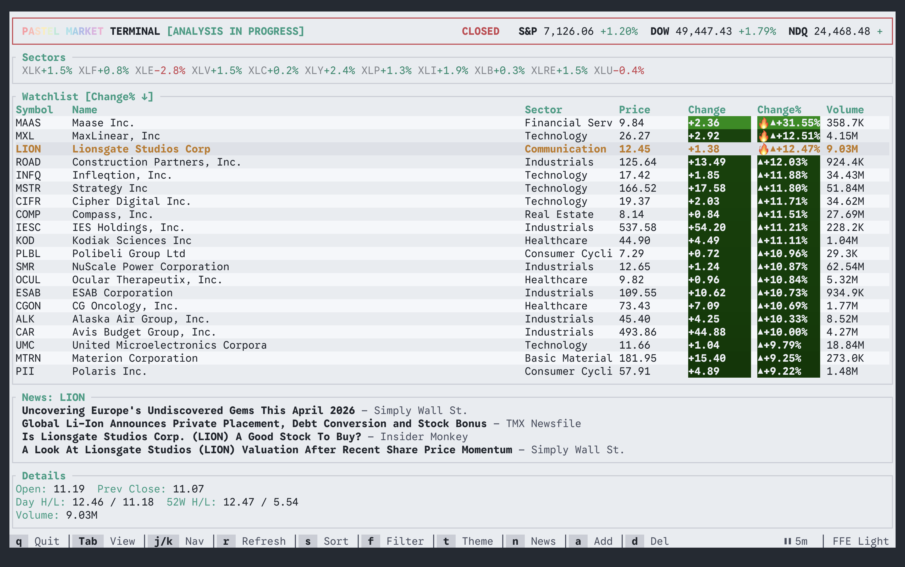
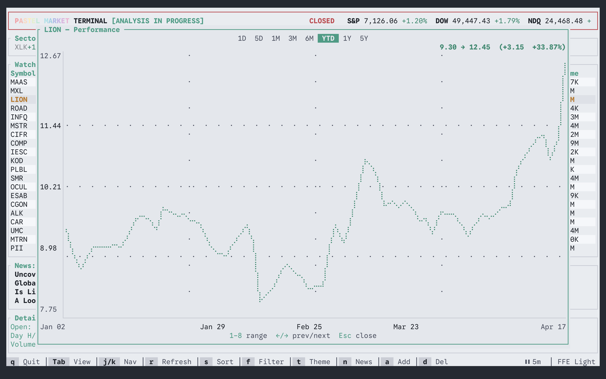

# Pastel Market

A terminal dashboard (TUI) that combines real-time market monitoring with
fundamental stock screening and earnings intelligence. Built with
[ratatui](https://ratatui.rs) and [crossterm](https://docs.rs/crossterm).

```
Monitor markets. Screen stocks. Gauge earnings. Inspect quality. Signal conviction. Fast.
```

| List View | Chart View |
|---|---|
|  |  |

## Features

- **Watchlist** — live quotes from Yahoo Finance with sparklines, 52-week
  ranges, sector tags, and heatmap-ranked price changes
- **Multiple watchlist tabs** — named tabs (`[`/`]` to switch) persisted across
  sessions for sector-based organizing
- **Scanners** — day gainers, day losers, most active, trending tickers, and
  Finviz fundamental screener with sort/filter support
- **Quality Control** — per-stock 5-point inspection checklist with 3 items
  auto-populated from live data (insider ownership, sector heat, historical
  earnings beats)
- **Conviction signaling** — any stock achieving 5/5 QC score triggers
  `HIGH CONVICTION - READY` in the header with a terminal bell alert
- **Earnings intelligence** — whisper numbers, implied volatility, grades, and
  report timing via Earnings Whispers (feature-gated)
- **Market clock** — Eastern Time display with time-to-close countdown during
  market hours
- **Pre/after-hours prices** — extended-hours price data shown in the detail pane
- **Clipboard export** — `y` copies selected symbol data to system clipboard
- **Mouse support** — scroll wheel navigation in watchlist and scanner tables
- **Help overlay** — `?` shows all keybindings in a popup
- **Performance chart** — interactive line chart overlay with selectable time
  ranges (1D–5Y) and tabbed bottom panel for news and SEC filings
- **News reader** — per-stock news headlines with publisher, age, and inline
  summary toggle
- **SEC filings** — recent EDGAR filings (10-K, 10-Q, 8-K, Form 4) with
  color-coded form types; ticker→CIK mapping embedded at compile time (~10K
  tickers) for instant resolution without runtime downloads
- **16 themes** — 8 dark + 8 light, cycled with `t`, persisted across sessions
- **Non-blocking UI** — all HTTP fetches run on background threads; the event
  loop never stalls

## Requirements

- Rust toolchain (MSRV 1.95.0, edition 2024)
- Terminal emulator supporting ANSI colors and alternate screen
- Internet access for Yahoo Finance and Finviz (falls back to mock data)

## Build and run

```sh
cargo run --release
```

Or with [Task](https://taskfile.dev):

```sh
task run
```

## Keybindings

| Key | Action |
|---|---|
| `q` / `Esc` | Quit |
| `?` | Toggle help overlay |
| `Tab` / `BackTab` | Cycle view: Watchlist → Scanner → QC |
| `j` / `k` | Navigate down / up |
| `gg` / `G` | Jump to first / last row |
| `h` / `l` | Switch focus (QC view: table ↔ checklist) |
| `Space` / `Enter` | Toggle QC item (QC view) / Open chart (Watchlist) |
| `r` | Refresh data |
| `s` | Cycle sort mode |
| `f` | Cycle filter mode |
| `t` | Cycle theme |
| `a` | Add symbol (Watchlist view) |
| `d` | Delete symbol (Watchlist view) |
| `y` | Copy selected symbol to clipboard |
| `[` / `]` | Previous / next watchlist tab |
| `n` | Toggle news panel |
| `1`–`5` | Select scanner (Scanner view) |

### Chart Overlay

| Key | Action |
|---|---|
| `Tab` / `BackTab` | Cycle panel: Chart → News → SEC Filings |
| `1`–`8` / `←` / `→` | Switch chart range (Chart tab) |
| `j` / `k` | Navigate headlines / filings (News / SEC tab) |
| `Enter` | Toggle inline news summary (News tab) |
| `Esc` | Close overlay (or close summary first) |

## Architecture

```
pastel-market/
├── crates/
│   ├── market-core/       Shared types, HTTP, config, logging, themes
│   ├── finviz-scraper/    Screener, insider detail, sector ETF performance
│   ├── yahoo-provider/    Cookie+crumb auth, QuoteProvider trait
│   └── whispers/          Earnings Whispers (feature-gated)
├── data/
│   ├── cik_map.ron        Embedded ticker→CIK map (~10K tickers)
│   └── mock.json          Fallback data for offline mode
├── src/
│   ├── main.rs            Terminal lifecycle + event loop
│   ├── app.rs             App state, key handlers, data refresh
│   ├── event.rs           EventHandler background thread
│   ├── worker.rs          Background HTTP fetch worker
│   └── ui/                Rendering modules
├── tests/
│   ├── fixture_parsing.rs Integration tests for HTML parsers
│   └── fixtures/          Captured HTML pages for deterministic testing
└── docs/rationale/        Design decision records
```

## License

MIT License. See [LICENSE](LICENSE).
